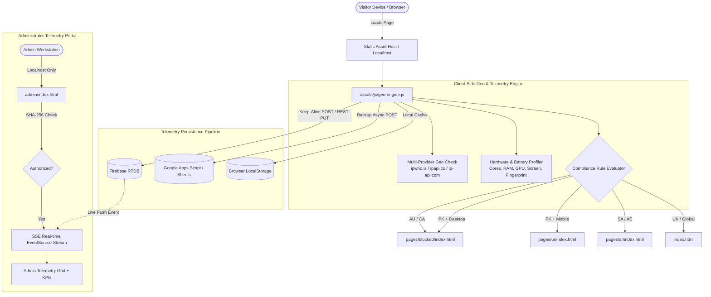

# CyberCity 2050 — System Architecture & Data Flow Specification
**Author:** Senior IT Specialist & Enterprise Architect  
**Scope:** Frontend Architecture, Telemetry Pipeline, Security Boundary & Cloud Integration  

---

## 1. High-Level Architectural Topology

CyberCity 2050 employs a **Hybrid Client-Edge Serverless Architecture**. It combines high-speed static asset delivery with client-side telemetry harvesting, edge geo-fencing, and dual-redundant serverless cloud persistence (Firebase Realtime Database + Google Apps Script / Google Sheets).

---

## 2. Technology Stack

| Layer | Technologies Used | Key Purpose |
| :--- | :--- | :--- |
| **Core Structure** | Semantic HTML5, SVG Symbol Sprites | Clean markup, high accessibility, zero layout shifts. |
| **Styling & Theme** | Vanilla CSS3, CSS Custom Properties, Glassmorphism | Solarpunk dark/emerald palette, responsive grids. |
| **Motion & Graphics** | HTML5 Canvas 2D, Intersection Observer, Dual Video Controller | Apple-style scroll canvas, seamless background video cross-fading. |
| **Security & Routing** | Multi-Provider IP Geolocation APIs, Web Crypto API | Geo-fencing, client profiling, SHA-256 admin password verification. |
| **Persistence** | Firebase Realtime Database (REST API), Google Apps Script, LocalStorage | Zero-cost serverless logging with real-time SSE streaming. |

---

## 3. Security Boundary & Hardening

1. **Localhost-Only Admin Enforcement:**
   * `admin/index.html` inspects `window.location.hostname`.
   * If the host is not `localhost`, `127.0.0.1`, or `::1`, the admin portal displays `#admin-public-blocked` overlay and disables all dashboard scripts.
2. **SHA-256 Cryptographic Authentication:**
   * Passwords and usernames are never stored or evaluated in plaintext.
   * Input strings are hashed via `crypto.subtle.digest("SHA-256", ...)`.
3. **Resilient Geolocation Fallback Hierarchy:**
   * Primary: `https://ipwho.is/` (Supports VPNs, high rate limits, zero CORS restrictions).
   * Secondary: `https://ipapi.co/json/`.
   * Tertiary: `http://ip-api.com/json/`.
   * Fast race timeout (1500ms) prevents page load blocking.
